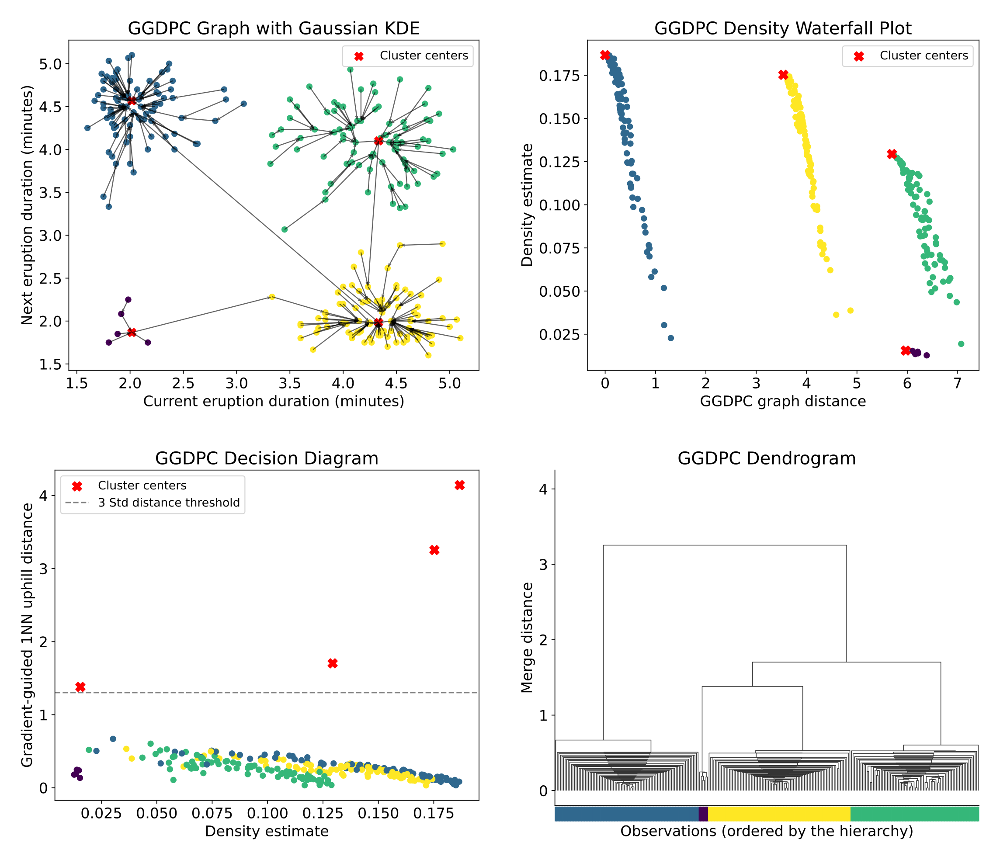

# Gradient-Guided Density Peak Clustering (GGDPC)

Official Python implementation accompanying the manuscript **Gradient-Guided Density Peak Clustering** by Yikun Zhang and Yen-Chi Chen.

GGDPC retains the simple graph construction of density peak clustering (DPC), but guides each nearest-higher-density search with one gradient-ascent step. This produces more stable uphill paths and connects the sample graph to the geometry of population gradient flows.

  

  <em>GGDPC on pairs of consecutive eruption durations in the Old Faithful data: the directed graph, density waterfall, decision diagram, and induced dendrogram.</em>

## Highlights

- **Gradient-guided uphill links.** Each observation takes a one-step mean-shift update before searching for a higher-density neighbor.
- **Automatic center selection.** Cluster centers can be selected from unusually long uphill edges without specifying the number of clusters, or through a user-supplied quantile.
- **Multiple geometric summaries.** Returned graph quantities support the decision diagram and density waterfall workflows, together with graph distances and a SciPy-compatible dendrogram.
- **Statistical guarantees.** The manuscript establishes clustering consistency, Gromov–Hausdorff convergence of the induced dendrogram, path-length stability, and convergence of the density waterfall representation.

## Method at a glance

Given observations X₁, …, Xₙ, GGDPC:

1. estimates the density and a one-step gradient-ascent update at every observation;
2. links each observation to the higher-density observation closest to its updated location;
3. uses the original point-to-parent distance as its gradient-guided 1NN uphill distance;
4. identifies cluster centers from unusually large uphill distances; and
5. assigns each remaining observation by following the directed graph to a selected center.

Compared with standard DPC, the extra gradient-guidance step aligns uphill links more closely with the local density geometry while preserving a simple, non-iterative graph construction.

## Installation

This repository is source-only: clone it and run Python from the repository root.

~~~bash
git clone https://github.com/zhangyk8/GGDPC.git
cd GGDPC

python3 -m venv .venv
source .venv/bin/activate
python3 -m pip install --upgrade pip
python3 -m pip install numpy scipy scikit-learn matplotlib
~~~

To run the notebooks and simulation study, also install:

~~~bash
python3 -m pip install pandas statsmodels jupyterlab
~~~

The code has been tested with Python 3.12. Earlier Python 3 versions may also work, but are not covered by automated tests.

## Quick start

The following self-contained example generates two Gaussian clusters and lets the default GGDPC center rule determine the number of clusters.

~~~python
import numpy as np

from GGDPC import GGDPC

rng = np.random.default_rng(7)
X = np.vstack([
    rng.normal(loc=(-1.5, 0.0), scale=0.35, size=(150, 2)),
    rng.normal(loc=( 1.5, 0.0), scale=0.35, size=(150, 2)),
])

labels, details = GGDPC(
    X,
    graph_dist=True,
    dendro=True,
)

cluster_ids = np.unique(labels[labels >= 0])
print("Clusters found:", len(cluster_ids))
print("Center indices:", details["cluster_centers"])
print("Linkage shape:", details["dendrogram"].shape)
~~~

By default, <code>GGDPC</code> returns <code>(labels, details)</code>. Set <code>return_details=False</code> to return only the labels. Observations classified as noise receive label <code>-1</code>.

### Center and noise controls

- <code>center_z</code> controls the automatic center rule. With the default <code>center_z=3</code>, eligible observations whose uphill distance exceeds the mean by more than three standard deviations are selected as centers.
- <code>center_quantile</code> replaces the automatic rule with a quantile threshold. For example, <code>center_quantile=1-k/n</code> is useful when approximately <code>k</code> centers are expected among <code>n</code> observations.
- <code>den_thres</code> marks observations below a chosen density quantile as noise. Its default is zero, so no observations are removed by density thresholding.
- <code>h_den</code> and <code>h_grad</code> control the density-estimation and gradient-guidance bandwidths. When both are omitted, a shared rule-of-thumb bandwidth is used.

The main entries in <code>details</code> are:

| Key | Description |
| --- | --- |
| <code>cluster_centers</code> | Indices of the selected cluster centers |
| <code>gg1nn_higher</code> | Parent index for each observation in the GGDPC graph |
| <code>den_est</code> | Density estimate at each observation |
| <code>grad_new</code> | One-step gradient-ascent update locations |
| <code>delta</code> | Gradient-guided 1NN uphill distances |
| <code>density_cutoff</code> | Density cutoff induced by <code>den_thres</code> |
| <code>graph_dist</code> | Distance from each observation to the graph root; returned when <code>graph_dist=True</code> |
| <code>dendrogram</code> | SciPy linkage matrix; returned when <code>dendro=True</code> |

The same module also provides the original DPC algorithm:

~~~python
from GGDPC import DPC

labels, details = DPC(X)
~~~

## Reproducing the paper results

Run all commands from the repository root because the notebooks and scripts use relative paths.

| Artifact | Purpose |
| --- | --- |
| <code>Old_Faithful_Data.ipynb</code> | Reproduces the four Old Faithful panels shown above and compares DPC-type methods |
| <code>GMM_Data.ipynb</code> | Reproduces the Gaussian-mixture DPC/GGDPC illustration and summarizes the simulation results |
| <code>GMM_Repeat_Sim.py</code> | Runs one Monte Carlo replication over all sample sizes and comparison methods |
| <code>GMM_Repeat_Sim.sbatch</code> | Launches 1,000 Monte Carlo replications as a Slurm array |
| <code>Syn_Res.py</code> | Aggregates per-job simulation outputs |
| <code>Syn_Res.sbatch</code> | Runs the aggregation step on Slurm |
| <code>Syn_Results/</code> | Contains the combined, mean, and standard-deviation result tables used by the notebook |

Launch the interactive examples with:

~~~bash
jupyter lab Old_Faithful_Data.ipynb
jupyter lab GMM_Data.ipynb
~~~

The Old Faithful notebook obtains R's <code>faithful</code> dataset through <code>statsmodels</code>; its first run therefore requires internet access.

### Monte Carlo study

The simulation script requires an integer job ID and writes one CSV per sample size:

~~~bash
mkdir -p Results out
python3 GMM_Repeat_Sim.py 1
~~~

For a Slurm cluster:

~~~bash
mkdir -p Results out
sbatch GMM_Repeat_Sim.sbatch

# Run after the array has completed.
sbatch Syn_Res.sbatch
~~~

The supplied batch files are templates containing cluster-specific partition, environment, resource, and email settings. Adapt those settings before submission. The full benchmark is computationally intensive: it evaluates seven methods at sample sizes from 500 to 8,000 over 1,000 replications, and several methods construct dense pairwise-distance matrices.

## Repository structure

| Path | Description |
| --- | --- |
| <code>GGDPC.py</code> | Main implementations of GGDPC and the original DPC |
| <code>dpc_helpers.py</code> | Input validation, parent searches, label propagation, graph distances, and dendrogram construction |
| <code>utils.py</code> | KDE, one-step mean shift, synthetic-data generation, and plotting utilities |
| <code>DPC_variants.py</code> | Implementations of DPC-KNN-PCA, SNN-DPC, DPC-CE, DPC-DLP, and DPC-MDNN |
| <code>Old_Faithful_Data.ipynb</code> | Old Faithful case study and Figure 1 workflow |
| <code>GMM_Data.ipynb</code> | Gaussian-mixture example, method comparisons, and result visualization |
| <code>GMM_Repeat_Sim.py</code> | Repeated Gaussian-mixture simulation |
| <code>Syn_Res.py</code> | Simulation-output aggregation |
| <code>Figures/</code> | Publication figures and the README overview image |
| <code>Syn_Results/</code> | Committed simulation results and summaries |

## Citation

The manuscript does not yet have a public DOI or arXiv identifier. Until a formal citation is available, please use:

~~~bibtex
@misc{zhang2026ggdpc,
  title  = {Gradient-Guided Density Peak Clustering},
  author = {Zhang, Yikun and Chen, Yen-Chi},
  year   = {2026},
  note   = {Manuscript},
  url    = {https://github.com/zhangyk8/GGDPC}
}
~~~

## License

This project is released under the [MIT License](LICENSE).

## Contact

For questions or comments, contact [Yikun Zhang](mailto:yikunz@uchicago.edu).
